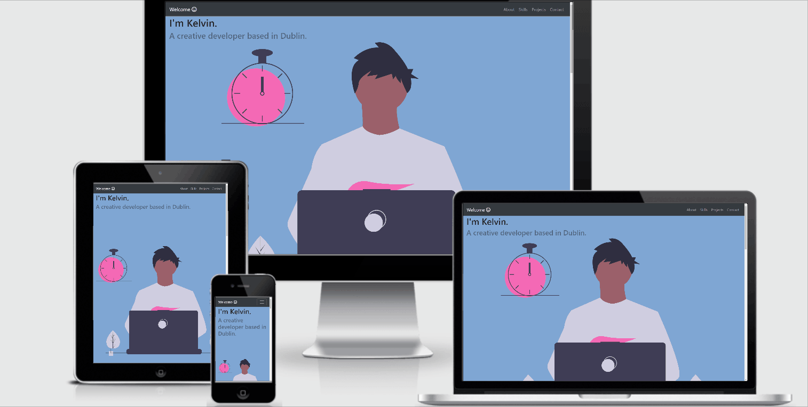

# Kelvin's Portfolio

Stream One Project: User-Centric Frontend Development - Code Institute

For my first milestone project, I have chosen to create a portfolio that is simple, modern, attractive and colour-blindness friendly in design. This is will be a portfolio that will serve as a clear career roadmap for those interested in learning what I have to offer as an IT and or marketing professional in the industry. 

## Demo 
 A live demo can be found [here](https://kel151.github.io/1stmilestoneproject/)
 
 Here is the responsive view:
 

## UX
### User Stories
As an employer, I want to be able to easily, swiftly, and seamlessly find a list of Kelvin’s skills and his proficiency in each one.

As a recruiter, I want to be able to easily, swiftly, and seamlessly view all of Kelvin’s software development and or marketing projects, both past and present.

As a member of the colour-blind community, I want to be able to view an attractive website without any serious difficulties brought about by my vision.

### Strategy
My goal was to build a portfolio that allows the user to find and view the information they want in as little steps as possible (across all devices) without compromising aesthetic appeal.

It was important to me to design a colour-blindness friendly UX design. This is because, in all my reading about UX/UI, I did not come across many UX/UI designers that made it a point to accommodate the needs of people who can’t view the world like everyone else. In fact, Ivan Tuchkov highlighted this very point in an article, in which he reminds UX designers that:

<i>“People with regular vision and people with protanopia see the same image. In the eyes of colorblind, the flower and the background are almost in the same color. And if we talk about user interfaces, such perception leads to a bunch of problems: text becomes unreadable, call-to-action buttons inconspicuous, etc.”</i> (Tuchkov, 2018)

Tuchkov goes to talk about how this issue can not only appear extremely discriminatory, but can also hurt the client’s aims:

<i>“Every type of color blindness causes inconvenience; this carries over to user experience. At worst, colorblind people cannot use a product at all. It’ll upset a lot of users and a business will lose potential clients too.”</i> (Tuchkov, 2018)

So, in this milestone project, I have taken upon myself the additional challenge of designing with colour-blindness in mind. 

### Scope
The purpose of this undertaking is to display my skills and projects in a way that is quick, simple and intuitive. It is meant to serve as a portfolio, showcasing my professional journey and career trajectory.

  
Having worked in the recuitment space, I understand that recruitrs and employers often don't have the time to sift through detailed resumés and portfolios. Additionally, being a marketing professional, I also understand that the attention span of the average buyer/user is growing shorter by the decade. Advertisements and promotions must be able to arrest attention and or convey a message within 2 seconds, lest they risk losing the onlooker forever.

Therefore, this portfolio will be slightly more narrow in scope than some others out there, and <strong>it will prioritise the more "at-a-glance" and "on-the-go" user.</strong>

### Surface
I decided to go with the blue, white, and pink colour scheme because my research showed that seemed to be a happy medium between a colour-blindness friendly aesthetic and an eye-catching and dynamic design. Many sources agreed that a minimalistic design was best so I opted to keep the general layout clean, clear, uncluttered.

From a purely stylistic point of view, I myself do favour the combination of blue and white anyway, for its minimalism, modern feel, and timeless quality. However, I decided to add a pop of pink to evoke a sense of dynamism and creativity, as I find that one of the few failings of blue and white coupled together is that it can come across a little boring, repetitive, and uninspired at times.

I must add that I was inititially going to go with a predominatly greyscale scheme because it is by far the most colour-blindness friendly aesthetic, however, that felt a little too bland for my personal taste. So, I eventually opted to go for white, blue, and pink combination while style designing with colour-blindness in mind where I could.

 
 ### Skeleton
Here are a list of the wireframes I developed during the inital mock-up. They are quite rduimentary, but they didn't need to be overly compelx. They merely needed to serve as a skeleton and a base for me to extrapolate upon. Two of the wireframes had to be redone because I was having trouble with creating responsive speechbubbles, so I opted for basic rectangles instead because they are far easier to make responsive. This is in reference to the about page and the projects page, so you will see two wireframes for each of those. 
<ol>
  <li>[Landing Page](wireframes/landingpage.png)</li>

  <li>[About Page](wireframes/about%20page.png)</li>

  <li>Skills</li>

  <li>Projects</li>

  <li>Contact</li>

</ol>
  
## Technologies Used
<ul>
    <li><a href="https://code.visualstudio.com/">Visual Code Studio</a> - code editor used for this project.
</li>
    <li><a href="https://en.wikipedia.org/wiki/HTML">HTML</a> - to create the structure of the project and define the "skeleton", so to     speak.
</li>
    <li><a href="https://en.wikipedia.org/wiki/Cascading_Style_Sheets">CSS</a> - to design and style the project, adding the "flesh to       the skeleton", so to speak
</li>
    <li><a href="https://getbootstrap.com/">Bootstrap</a> - used as a framework to make design faster and easier.
</li>
    <li><a href="https://git-scm.com/">Git</a> - used for version control.
</li>
</ul>
  
## Additional resources and tools
<ul>
  <li><a href="https://www.w3schools.com/">W3 Schools</a>
</li>
  <li><a href="https://stackoverflow.com/">Stack Overflow</a>
</li>
  <li><a href="https://css-tricks.com/">CSS-Tricks</a>
</li></li>
  <li><a href="https://github.com/">GitHub</a>
</ul>

## Colour-blindness research sources:
Tuchkov, I. 2018. http://www.garethbotha.com/color-blindness-usability-testing/. Accessed: November 5th 2019.

Bigman, A. 2012. <a href="https://99designs.ie/blog/tips/designers-need-to-understand-color-blindness/">Why all designers need to understand color blindness</a>. Accessed: November 5th 2019.

Hiller, L. 2018. <a href="https://econsultancy.com/considering-colour-blindness-in-ux-design-with-five-examples/">Considering colour blindness in UX design (with five examples)</a>. Accessed: November 5th 2019.
  
Cravit, R. 2019. <a href="https://venngage.com/blog/color-blind-friendly-palette/">How to Use Color Blind Friendly Palettes to Make Your Charts Accessible</a>. Accessed: November 5th 2019.

Botha, G. 2017. <a href="http://www.garethbotha.com/color-blindness-usability-testing/">Color Blindness in Usability Testing</a>. Accessed: November 5th 2019.
